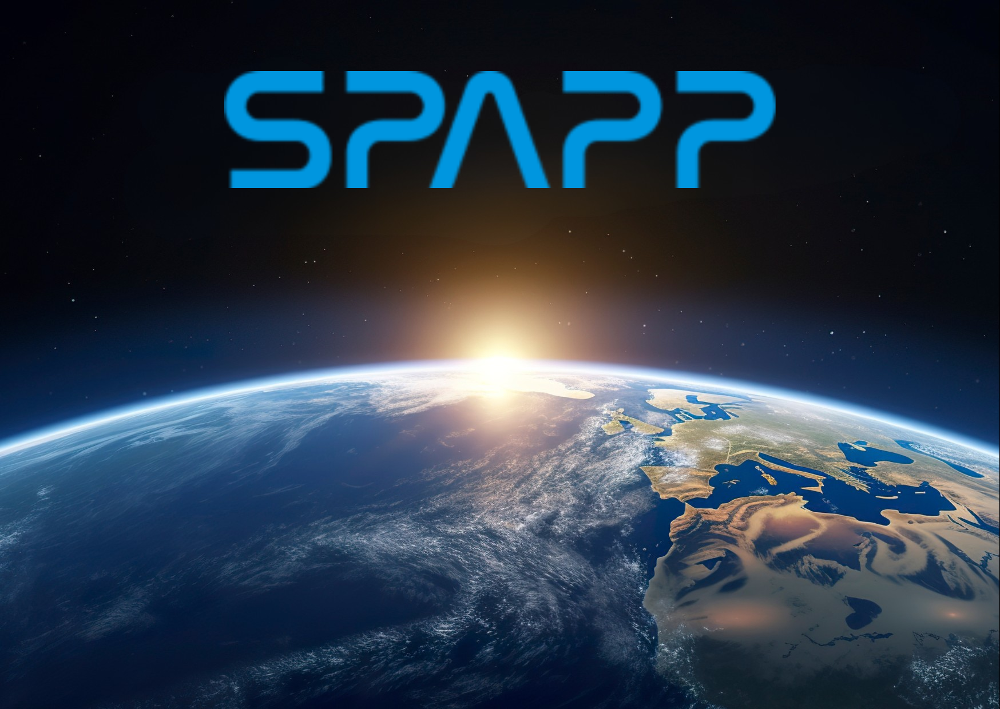

[](https://github.com/Henrycoding-design/SPACEAPPEXE/releases)
[](https://github.com/Henrycoding-design/SPACEAPPEXE/stargazers)
[](https://github.com/Henrycoding-design/SPACEAPPEXE/issues)
[](https://github.com/Henrycoding-design/SPACEAPPEXE)
[](https://www.python.org/)
[](https://www.riverbankcomputing.com/software/pyqt/)
[](https://threejs.org/)
[](#)

# SPACEAPP v5.6.x

*Real-time satellite tracking, mission intelligence, orbital analysis, and spacecraft visualization.*

<p align="center">

**[🚀 Features](#capabilities)** &nbsp;•&nbsp;
**[⚙️ Setup](#setup)** &nbsp;•&nbsp;
**[🛰️ Quick Start](#quick-start)** &nbsp;•&nbsp;
**[🧩 Tech Stack](#tech-stack)** &nbsp;•&nbsp;
**[👤 Credits](#credits)**

</p>

---

# Overview

SPACEAPP is a desktop application designed for satellite tracking, mission exploration, and space education. It combines live orbital data, advanced search capabilities, AI-assisted mission intelligence, and interactive spacecraft visualization into a unified platform.

Whether you're monitoring Starlink satellites, researching scientific missions, exploring orbital mechanics, or tracking the International Space Station, SPACEAPP provides a streamlined environment for understanding humanity's activity in space.

---

# Capabilities

## 🛰️ Real-Time Tracking & Prediction

Monitor satellites and spacecraft using live orbital data and project their paths.

* **Live Position Tracking:** Multi-satellite monitoring with real-time speed and altitude calculations.

* **Satellite Path Prediction:** Visualize future orbital trajectories, predicted satellite positions, historical positions, and ground-track paths.

* **Raw TLE Inspection:** Inspect raw Two-Line Element (TLE) data used for SGP4 orbital propagation and tracking.

---

## 🎮 Interactive 3D Spacecraft Models *(Updated in v5.6.5)*

Inspect spacecraft structures and physical appearances directly alongside mission information and tracking data.

* **Supported Models:**

* Starlink

* GPS Satellites

* Weather Satellites

* Science Satellites

* International Space Station (ISS)

* Tiangong Space Station

* James Webb Space Telescope

* Hubble Space Telescope

* CubeSat

* SpaceX Dragon

* **Boeing Starliner** *(New in v5.6.5)*

* **Immersive 3D Canvas:** High-fidelity gradient blue & neon purple viewport environment.

* **Smart Camera Transition:** Reset View and initial model loads trigger an automated smooth zoom-in effect, keeping the target spacecraft beautifully framed and detailed.


---

## 📖 TLE & Orbital Mechanics Documentation *(New in v5.6.5)*

SPACEAPP now includes a dedicated reference guide explaining Two-Line Element (TLE) sets, their structural breakdown, and how they drive all geometric, SGP4 propagation, and orbital calculations across the application.

> [!NOTE]
> **Educational Reference Site**
> 
> 
> Access the full component breakdown, Keplerian element definitions, and spatial transformation math via the built-in window or by viewing [TLE & Space Math Guide](https://www.google.com/search?q=tle_guide.html).
> 
> 

---

## 🧠 AI Mission Intelligence & RAG Profiles


Transform raw technical telemetry into comprehensive, context-rich educational insights.

* **RAG + Web Search Profiles:** Mission profiles are powered by Retrieval-Augmented Generation (RAG) and web-backed research systems to provide:


* Launch date, Operator, and Country


* Detailed mission description and current operational status


* Days in space and estimated completed orbits


* **Educational Insights:** AI-assisted overviews helping users understand:


* Mission objectives & scientific contributions


* Historical significance & technology highlights


* Operational purpose


* **Edge Function Multi-Key Rotation & Model Fallbacks:** Under-the-hood upgrades support dynamic API key rotation and multi-model fallback chains to eliminate service lockups.


* **Resilient Cache Fallback:** Gracefully defaults to expired local caches to compile AI overviews if network retrievals fail.


---

## 🌍 Advanced Orbital & Coverage Analysis *(Updated in v5.6.5)*

Perform detailed mathematical and geometric assessments of spacecraft paths and ground footprints.

* **Orbital Geometry Analysis:** Explore orbit classification, orbital inclination, altitude range, orbital period, ground-track behavior, and mission-specific characteristics.


* **Coverage & Footprint Metrics (Enhanced in v5.6.5):** Evaluates the geometric footprint on Earth's surface enabled by the satellite's angular subtense ($\theta$):


* **Footprint Radius ($R_{\text{cov}}$):** Ground coverage radius projected along Earth's curvature:


$$R_{\text{cov}} = \theta \cdot R_e$$


* **Footprint Surface Area:** Calculates the physical ground area visible using spherical cap geometry:


$$A = 2 \cdot \pi \cdot R_e^2 \cdot (1 - \cos(\theta))$$


* **Percentage Earth Coverage:** Determines the exact fraction of total global surface area within line-of-sight:


$$\text{Coverage Percentage} = \frac{1 - \cos(\theta)}{2}$$


* **Lifespan Analysis:** View operational history and mission longevity information (time spent in orbit, original mission duration, mission extensions, and estimated service lifespan).


---

## 🔬 Research View


A consolidated workspace layout designed for deeper spacecraft exploration, unifying:

* Interactive 3D Models


* Detailed Mission Profiles & Intelligence


* Orbital & Coverage Analysis


* Lifespan and Capability assessments


---

## 🔎 Advanced Search System & Databases


Find satellites quickly using multiple pre-indexed search methods.

* **Supabase Search Infrastructure:** Pre-indexed data synchronized through Supabase for rapid alias searching and background sync.


* **Search Methods:** Name & alias searching, Category browsing, NORAD ID lookup, and Global visibility searches.


### Advanced Sky Search (`near:`)

Search for satellites visible from virtually anywhere on Earth using specific parameters.

**Example Query:**

```text
near: Tokyo, Japan; radius: 45
```

**Supported Parameters:**

```text
near: <place or coordinates>;
alt: <altitude>;
radius: <0-90>;
catid: <satellite category ID>;
```

*Note: If optional parameters are omitted, SPACEAPP uses your current values.*

---

## ⚡ Smart API Optimization

SPACEAPP automatically reduces API usage while maintaining a smooth tracking experience, yielding a consumption reduction of **25% or more**.

---

## 🎨 UI Enhancements

A refreshed workspace experience with intuitive window management.

* **Balanced Default Layout:** Workspace panel split ratio (**Map | 3D View**) set to an optimized **60/40 ratio**.
* **Dynamic Splitters:** Resizable panel spaces powered by `QSplitter`.
* **Visual Hierarchy:** Clean, cohesive layout organization and expanded dynamic iconography.

---

## ⚙️ System Utilities: Updates & Communication

The application features a built-in communication system that keeps you connected with the latest development cycles.

* **Check Info System:** Connects to GitHub servers for release notifications, surveys, and developer announcements.
* **Auto-Notification:** Alerts when database updates are recommended.

---

## 🖥️ System Utilities: Cross-Platform Deployment

* **Windows x64 Installer (Inno Setup):** Handles custom paths, application registration, and clean uninstallations.
* **macOS ZIP Build:** Native drag-and-drop deployment package for Apple ecosystems.

---

# Setup

## Step 1 - Obtain an API Key

Create an account with N2YO and obtain an API key (License Key) [here](https://www.n2yo.com/login/edit/).

## Step 2 - Initial Setup

1. Launch SPACEAPP
2. Enter your API key when prompted
3. Complete account creation

## Step 3 - Login

1. Enter your created credentials
2. Begin exploring

## Step 4 - Create Account

1. Launch SPACEAPP (or click the Logout Icon if you're still inside the tracking window)
2. Select **Signup**
3. Start entering your new Username, Password, and API Key
4. Complete your account creation
*This will create a different account on the application.*

---

# Quick Start

### Tracking a Satellite

1. Launch SPACEAPP
2. Select a category
3. Choose a satellite
4. View real-time tracking information

### Searching by NORAD ID

1. Enter a NORAD ID
2. Press **Search**
3. Review available tracking information

### Exploring Research Features

1. Open a supported spacecraft
2. Switch to **Research View**
3. Explore mission, math, and orbital coverage metrics

---

# Satellite Database

Satellite information changes over time as missions launch, evolve, and conclude.

### Supabase Database

Cloud-hosted and automatically maintained.

* Pre-indexed searches
* Alias support
* Synchronization
* Search optimization

### Local Database

Stored on your device for fast local access. SPACEAPP may occasionally recommend updates to maintain tracking accuracy, search accuracy, satellite metadata, and operational status information.

> [!NOTE]
> Database updates are recommended for the best experience.

> [!IMPORTANT]
> During setup or database updates, avoid closing the application or interrupting the process. Unexpected interruptions may corrupt local data and require recovery or reinstallation.

---

# Location Notice

SPACEAPP estimates your location using your public IP address.

* VPN usage may reduce location accuracy.
* Location data remains cached until the application closes.
* Switching accounts does not refresh location information.

**If your location changes significantly:**

1. Close SPACEAPP
2. Reopen the application

---

# Available Information Reference

Depending on availability, SPACEAPP displays the following data fields:

* Satellite Name & NORAD ID
* Live Position, Speed, & Altitude
* Ground Track & Orbital Path (TLE)
* Launch Date, Operator, & Country of Origin
* Mission Description & Operational Status
* Days in Space & Completed Orbits
* Footprint Area & Coverage %
* Orbital Geometry Analysis
* Mission Intelligence Summary
* Interactive 3D Models

---

# API Modes

SPACEAPP includes smart API-saving technology that automatically reduces calls for non-Starlink satellites.

| Satellite Type    | Mode          | Base Interval | Effective Update Rate              |
| ----------------- | ------------- | ------------- | ---------------------------------- |
| Starlink Only     | Efficient     | 8 s           | Every 8 s                          |
| Starlink Only     | Non-Efficient | 3 s           | Every 3 s                          |
| Non-Starlink Only | Efficient     | 8 s           | Every 16 s                         |
| Non-Starlink Only | Non-Efficient | 3 s           | Every 6 s                          |
| Mixed (Equal)     | Efficient     | 8 s           | Starlink: 8 s / Non-Starlink: 16 s |
| Mixed (Equal)     | Non-Efficient | 3 s           | Starlink: 3 s / Non-Starlink: 6 s  |

### Recommendations

* **Efficient Mode:** Recommended for daily use, long monitoring sessions, and reduced API consumption.
* **Non-Efficient Mode:** Recommended for faster refresh rates, short-term monitoring, and situations where API usage limits are not a concern.

---

# Privacy

* SPACEAPP uses publicly available satellite and mission data sources.
* No personal information is collected beyond what is required for normal application operation.
* Location estimates are used solely to support local tracking and visibility calculations.

---

# 🧩 Tech Stack

| Layer | Technology |
| --- | --- |
| **Language** | Python |
| **Desktop UI** | PyQt6 |
| **3D Visualization** | Three.js |
| **Orbital Propagation** | SGP4 |
| **Database** | Supabase |
| **AI / Intelligence** | Google Gemini |
| **Satellite Data** | N2YO |
| **Web Rendering** | Qt WebEngine |
| **Windows Packaging** | Inno Setup |
| **macOS Packaging** | ZIP Distribution |

---

# Support 

**Email:** [tanbinhvo.hcm@gmail.com](mailto:tanbinhvo.hcm@gmail.com)

Questions, bug reports, feedback, and feature suggestions are welcome.

If SPACEAPP has been helpful to you:

* ⭐ Star the repository
* 🐞 Report bugs or suggest new features
* 📖 Cite the project in academic work using `CITATION.cff`
* ☕ Support via [Buy Me a Coffee](https://buymeacoffee.com/votanbinh) or [Ko-fi](https://ko-fi.com/tanbinhvo)

---

# Credits

SPACEAPP was created and is maintained by **Vo Tan Binh (Henry Vo)**.

Special thanks to the open-source community and the developers behind the technologies that make SPACEAPP possible, including:

- PyQt6
- Three.js
- Supabase
- SGP4
- Google Gemini
- N2YO
- Inno Setup
- Qt WebEngine
- Other open-source libraries used throughout the project

If you use SPACEAPP in research, education, demonstrations, publications, or derivative works, please consider citing the project using the provided [CITATION.cff](CITATION.cff) file.

---

# License

© Vo Tan Binh / SPACEAPP. All rights reserved.

This software and its associated assets, models, artwork, databases, and source code are protected by copyright.

Redistribution or reuse without explicit permission from the author is prohibited.
